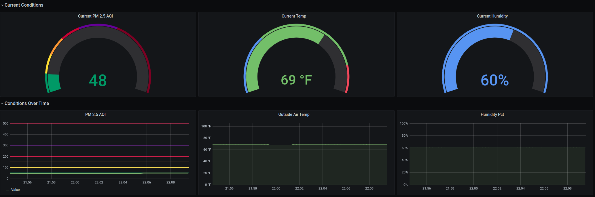

# purpleair-to-prometheus
This simple script pulls air quality data from [PurpleAir](https://www.purpleair.com), calculates AQI using [python-aqi](https://pypi.org/project/python-aqi/) and exports it to [Prometheus](https://prometheus.io/) 

## Example dashboard

You an import this example dashboard to [grafana](https://github.com/grafana/grafana) by copying in [grafana-dashboard.json](./grafana-dashboard.json)

## Example kubenetes deployment
I run this on my home [kubernetes](https://kubernetes.io/) ([k3s](https://k3s.io/)) cluster. You can see an example kubernetes deployment which integrates with [prometheus-operator](https://github.com/prometheus-operator) at [example-kube.yaml](./example-kube.yaml)
